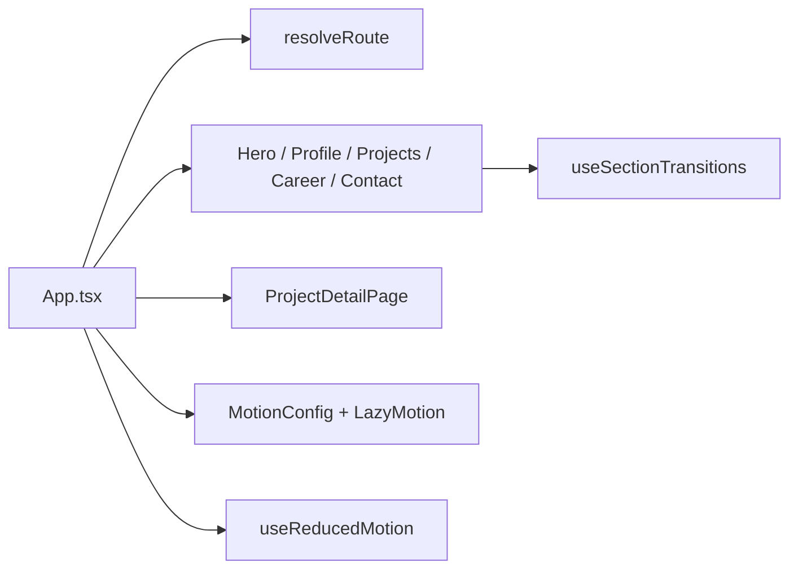

# Portfolio Page

Interactive portfolio site built with React, Vite, and motion-driven section transitions.

<p align="center">
  
</p>

<p>
  
  
  
  
</p>

## Overview

This repository contains a single-page portfolio with project detail routes, scroll-based section transitions, and a mobile-first visual system. It uses a narrow stage layout, reduced-motion support, and route-aware project overlays so the home scroll position is preserved while browsing case studies.

## Screens

The visual system is asset-backed. Key public assets include:

| Area | Asset |
| --- | --- |
| Hero | `public/assets/hero/hero-bg-perfect.png` |
| Profile | `public/assets/profile/profile-photo.png` |
| Career | `public/assets/career/trophy.png`, `briefcase.png` |
| Contact | `public/assets/contact/mail.png`, `map-pin.png`, `phone.png` |

## Architecture



## Getting Started

```bash
npm install
npm run dev
```

Build and preview:

```bash
npm run build
npm run preview
```

## Project Layout

```text
.
├── src/
│   ├── App.tsx                     # Routing and page composition
│   ├── components/                 # Sections and project detail UI
│   ├── data/portfolio.ts           # Case-study metadata
│   ├── hooks/                      # Motion and accessibility hooks
│   └── styles.css                  # Visual system
├── public/assets/                  # Hero, profile, contact, and career imagery
├── package.json
└── vite.config.ts
```

## Implementation Notes

- Route state is managed in the app shell without adding a router dependency.
- Project detail pages preserve the original home scroll position.
- Motion respects `prefers-reduced-motion`.
- The repository includes historical layout-fix scripts; the active application code is under `src/`.
