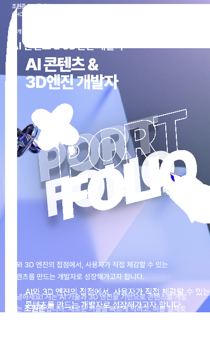
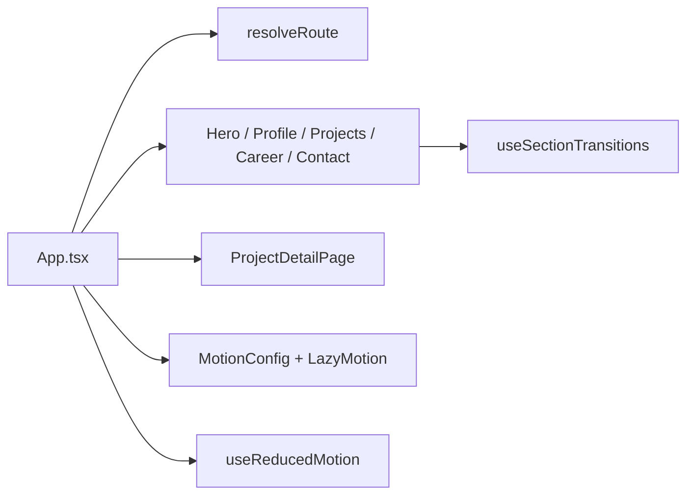

# Portfolio Page

React, Vite, Motion 기반의 인터랙티브 포트폴리오 사이트입니다. 스크롤 전환, 프로젝트 상세 라우트, 모바일 우선 레이아웃을 중심으로 구성했습니다.

<p align="center">
  
</p>

<p>
  
  
  
  
</p>

## 개요

이 저장소는 단일 페이지 포트폴리오와 프로젝트 상세 화면을 포함합니다. 좁은 모바일 스테이지, 섹션별 스크롤 전환, reduced motion 대응, 홈 스크롤 위치를 유지하는 프로젝트 오버레이 라우팅을 구현했습니다.

## 화면 자산

시각 요소는 `public/assets/` 아래의 실제 자산을 기반으로 구성됩니다.

| 영역 | 자산 |
| --- | --- |
| 히어로 | `public/assets/hero/hero-bg-perfect.png` |
| 프로필 | `public/assets/profile/profile-photo.png` |
| 커리어 | `public/assets/career/trophy.png`, `briefcase.png` |
| 연락처 | `public/assets/contact/mail.png`, `map-pin.png`, `phone.png` |

## 구조



## 시작하기

```bash
npm install
npm run dev
```

빌드와 미리보기는 다음 명령으로 실행합니다.

```bash
npm run build
npm run preview
```

## 레포 구조

```text
.
├── src/
│   ├── App.tsx                     # 라우팅과 페이지 조합
│   ├── components/                 # 섹션과 프로젝트 상세 UI
│   ├── data/portfolio.ts           # 프로젝트 메타데이터
│   ├── hooks/                      # 모션과 접근성 훅
│   └── styles.css                  # 시각 시스템
├── public/assets/                  # 히어로, 프로필, 연락처, 커리어 이미지
├── package.json
└── vite.config.ts
```

## 구현 메모

- 별도 라우터 의존성 없이 앱 셸에서 라우트 상태를 관리합니다.
- 프로젝트 상세 화면을 열어도 홈 스크롤 위치를 유지합니다.
- `prefers-reduced-motion` 설정을 감지해 모션을 줄입니다.
- 과거 레이아웃 보정 스크립트가 포함되어 있지만, 현재 앱 코드는 `src/` 아래에 있습니다.
